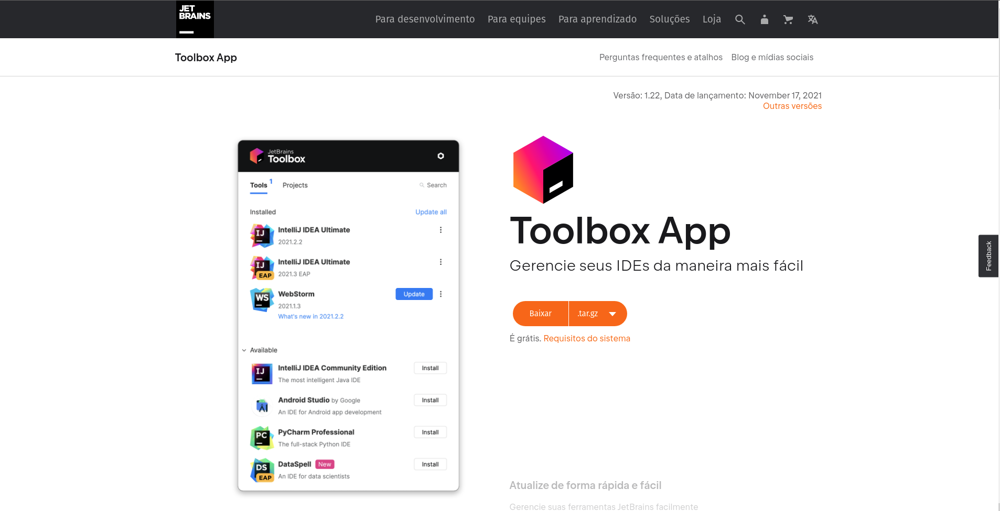
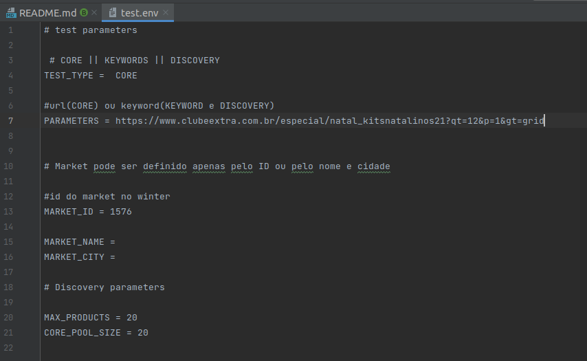

# Webcrawler Node

Webcrawler node is a java project that contains core-type and ranking-type crawler codes from all the markets we monitor.

## Index

- [Getting Started](#getting-started)
    - [Prerequisites](#prerequisites)
        - [Install Java](#install-java)
        - [Install IDE](#install-ide)
        - [VPN connection](#vpn-connection)
        - [Configuration files](#configuration-files)
        - [Clone project](#clone-project)
        - [Configure maven](#configure-maven)
- [Launch Configurations](#launch-configurations)

## Getting Started

These instructions will get you a copy of the project up and running on your local machine for development and testing purposes. See deployment for notes on how to deploy the project on a live system.

### Prerequisites

What programs and languages you need to install and how to install them

#### Install Java

- Open a terminal (Ctrl-Alt-T) and switch it to root permissions by entering:

```bash
$ sudo su
```

- Make sure Eclipse Indigo is NOT installed in your Ubuntu. You may need to remove both "eclipse" and "eclipse-platform" packages to get rid of it. If it still gets into way when trying to install
  Luna using this easy way, you may need to look at the "hard way" below.

```bash
# apt-get remove eclipse eclipse-platform
```

- Install a Java 11 JDK:

```
  # apt-get update
  # apt-get install openjdk-11-jdk
```

- Install Maven:

```bash
# apt-get install maven
```

- Get rid of the root access as you won't need it anymore:

```bash
# exit
```

---

#### Configuration files

You need to create a file named settings.xml. This file is for download maven dependencies. To create this file, you will need AWS credentials (search in your vault manager for _aws programmatic_ or
ask for your leader).

After that you need to add that file to your home's .m2 folder.

- linux: `$HOME/.m2/settings.xml`
- windows: `%USERPROFILE%\.m2\settings.xml`

example:

```xml
<?xml version="1.0"?>

<settings xsi:schemaLocation="http://maven.apache.org/SETTINGS/1.0.0 http://maven.apache.org/xsd/settings-1.0.0.xsd" xmlns:xsi="http://www.w3.org/2001/XMLSchema-instance"
          xmlns="http://maven.apache.org/SETTINGS/1.0.0">
    <servers>
        <server>
            <id>lett-maven</id>
            <username>INSERT YOUR USERNAME HERE</username>
            <password>INSERT YOUR PASSWORD HERE</password>
        </server>
    </servers>
</settings>
```

> NOTE: You need read permissions on AWS IAM to read lett-maven's bucket to download maven dependencies

---

#### Clone project

```bash
# git clone git@github.com:lettdigital/webcrawler-node.git
```

---

#### Configure maven

In your eclipse, set your project for a maven project, after that the dependencies will be downloaded.

Or you can run it in terminal:

```bash
#
# 3nvm clean install -U
```

> NOTE: This command will clean and force install maven dependencies.


---

## Install IDE

###  Install IntelliJ (_recommended_)

- Download the latest version of

  


- Extract files

```bash
$ tar -xvf jetbrains-toolbox-*.tar.gz
```

- Go to the extracted folder and run the following command:

```bash
$ ./jetbrains-toolbox-*/jetbrains-toolbox
```

- Install the IntelliJ Idea

---

### VPN connection

Before running the application, you need to connect to our VPN.

Check on 1Password if you have already been granted VPN access and then follow this installation and configuration [tutorial](https://www.notion.so/lettdigital/VPN-fb27854c42d447cbb52a411a8098012c).

---

## Running the tests

But you can test localy configuring a application debug in your IDE.

Here below you see how to config in Intellij IDEA, but is very similar in others IDEs:


1 - First create a application debugger, in can find under `run/debug`

2 - Set the main class: `br.com.lett.crawlernode.test.Test`

3 - Set the environment variables:


Fill the {{USERNAME}} and {{PASSWORD}} from the example below and paste to the Environment variables on IDE.

Example:

```dotenv
CRAWLER_THREADS=1
ENVIRONMENT=production
FETCHER_URL=https://fetcher-new.lett.global/
HIKARI_CP_CONNECTION_TIMEOUT=60000
HIKARI_CP_IDLE_TIMEOUT=20000
HIKARI_CP_MAX_POOL_SIZE=3
HIKARI_CP_MIN_IDLE=2
HIKARI_CP_VALIDATION_TIMEOUT=5000
KINESIS_STREAM=sku-core-crawler-kinesis-stream
LETT_MONGO_FETCHER_DATABASE=fetcher
LETT_MONGO_FETCHER_HOST=mongodb0.lett.global, mongodb1.lett.global, mongodb2.lett.global
LETT_MONGO_FETCHER_PASSWORD={{PASSWORD}}
LETT_MONGO_FETCHER_PORT=27017
LETT_MONGO_FETCHER_USERNAME=crawler
LETT_MONGO_FROZEN_DATABASE=frozen
LETT_MONGO_FROZEN_HOST=mongodb0.lett.global, mongodb1.lett.global, mongodb2.lett.global
LETT_MONGO_FROZEN_PASSWORD={{PASSWORD}}
LETT_MONGO_FROZEN_PORT=27017
LETT_MONGO_FROZEN_USERNAME={{USERNAME}}
LETT_MONGO_INSIGHTS_DATABASE=insights
LETT_MONGO_INSIGHTS_HOST=mongodb0.lett.global, mongodb1.lett.global, mongodb2.lett.global
LETT_MONGO_INSIGHTS_PASSWORD={{PASSWORD}}
LETT_MONGO_INSIGHTS_PORT=27017
LETT_MONGO_INSIGHTS_USERNAME={{USERNAME}}
LETT_MONGO_PANEL_DATABASE=panel
LETT_MONGO_PANEL_HOST=localhost
LETT_MONGO_PANEL_PASSWORD=pass
LETT_MONGO_PANEL_PORT=27017
LETT_MONGO_PANEL_USERNAME=manager
LETT_POSTGRES_DATABASE=products
LETT_POSTGRES_HOST=postgres-prod.lett.global
LETT_POSTGRES_PASSWORD={{PASSWORD}}
LETT_POSTGRES_PORT=5432
LETT_POSTGRES_USERNAME={{USERNAME}}
LOGS_BUCKET_NAME=lett-webscraper-htmls-dev
USE_FETCHER=false
S3_BATCH_USER={{USERNAME}}
S3_BATCH_HOST=s3-batch.lett.global
S3_BATCH_REMOTE_LOCATION=/s3_buckets/batch
SSH_KEYS_BUCKET=lett-ssh-keys
S3_BATCH_PASS={{PASSWORD}}
ATTEMPTS_FOR_EACH_PROXY=2
CHROME_PATH={{CHROME_DRIVE_PATH}}
HTML_PATH={{HTML_SAVE_PATH}}
DEBUG=true
LETT_ELASTIC_HOST=vpc-elastic-market-sku-catalog-kfx4irdqtawrf5cxgjspmanmea.us-east-1.es.amazonaws.com
LETT_ELASTIC_PORT=443
LETT_ELASTIC_USERNAME={{USERNAME}}
LETT_ELASTIC_PASSWORD={{PASSWORD}}
LETT_ELASTIC_INDEX=market_sku_catalog
DYNAMO_TABLE_NAME="capture_job_dev"
```


4 - Run command in terminal to create a aplication run configuration file:

```bash
$ cp src/java/br/com/lett/crawlernode/test/example.env src/java/br/com/lett/crawlernode/test/test.env
```

5 - Open the test.env file and define test arguments:



> NOTE: The test type can be 'CORE', 'KEYWORDS' for ranking crawler or 'DISCOVERY'. 

> NOTE 2: If you set 'CORE', you need change product URL in the [Test class](https://github.com/lettdigital/webcrawler-node/blob/master/src/java/br/com/lett/crawlernode/test/Test.java#L105) to correct scrap the page

### And coding style tests

https://www.notion.so/lett/Java-Style-Guideline-512c01ec2de04d77a3af73e78e9005eb

## Deployment

Use tag [deploy:Production] in your commit for deploy changes, but this only can be done on branch master

## Authors

<table>
  <tr>
    <td align="center"><a href="https://github.com/gabrieldta"><br /><sub><b>Gabriel Dornelas</b></sub></a><br />💻</td>
    <td align="center"><a href="https://github.com/BuSSoLoTTi"><br /><sub><b>BuSSoLoTTi</b></sub></a><br />💻</td>
    <td align="center"><a href="https://github.com/tscientist"><br /><sub><b>Caroline Evangelista</b></sub></a><br />💻</td>
  </tr>
</table>

## Acknowledgments

* REAMDE.md template from [PurpleBooth](https://gist.githubusercontent.com/PurpleBooth/109311bb0361f32d87a2/raw/8254b53ab8dcb18afc64287aaddd9e5b6059f880/README-Template.md)
